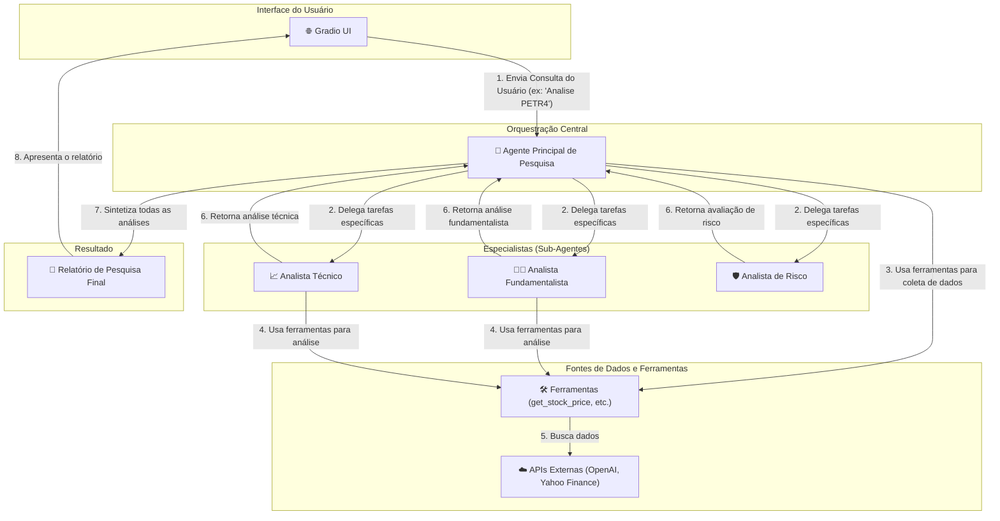

# Agente de Pesquisa de Ações com IA (Deep Agent)

Este projeto implementa um sistema de agentes de IA autônomos para realizar análises de mercado de ações de forma abrangente. Utilizando uma arquitetura de múltiplos agentes (um agente principal e sub-agentes especialistas), a ferramenta coleta, analisa e sintetiza dados para gerar relatórios de pesquisa detalhados.

## Diagrama de Arquitetura

O fluxo de trabalho do sistema é orquestrado por um agente principal que delega tarefas para sub-agentes especialistas, cada um com acesso a um conjunto de ferramentas de análise de dados.



## Funcionalidades

-   **Análise Fundamentalista**: Avalia a saúde financeira da empresa através de balanços, P/L, ROE, etc.
-   **Análise Técnica**: Identifica tendências de preço, padrões gráficos, médias móveis e indicadores como RSI.
-   **Avaliação de Risco**: Analisa riscos de mercado, setoriais e específicos da empresa.
-   **Orquestração Autônoma**: O agente principal gerencia o fluxo de trabalho, delegando tarefas e sintetizando os resultados.
-   **Interface Web Simples**: Utiliza o Gradio para uma interação fácil com o usuário.

## Fluxo

1.  **Consulta do Usuário**: O usuário insere uma solicitação de pesquisa (ex: "Faça uma análise completa do Petróleo Brasileiro S.A. (PETR4)") na interface do Gradio.
2.  **Delegação de Tarefas**: O **Agente Principal** recebe a consulta e a divide em tarefas menores, delegando-as aos sub-agentes apropriados:
    -   **Analista Fundamentalista**: Recebe a tarefa de analisar os fundamentos da empresa.
    -   **Analista Técnico**: Fica responsável pela análise técnica dos gráficos e indicadores.
    -   **Analista de Risco**: Avalia os riscos associados ao investimento.
3.  **Uso de Ferramentas**: Cada agente utiliza as ferramentas disponíveis (baseadas na biblioteca `yfinance`) para buscar dados financeiros, preços históricos e outras informações relevantes.
4.  **Síntese**: O Agente Principal coleta as análises individuais de cada sub-agente.
5.  **Geração do Relatório**: Com base em todas as informações coletadas e analisadas, o agente principal elabora um relatório final coeso e estruturado.
6.  **Apresentação**: O relatório final é exibido na interface do Gradio para o usuário.

## Configuração e Instalação

Configure as Variáveis de Ambiente**
Crie um arquivo `.env` na raiz do projeto e adicione sua chave da API da OpenAI.
```
OPENAI_API_KEY="sua_chave_api_aqui"
OPENAI_MODEL="gpt-4-turbo"
```

Para facilitar a execução do projeto, você pode utilizar o Docker Compose. Certifique-se de ter o Docker e o Docker Compose instalados em sua máquina.

```bash
docker-compose up -d
```

A aplicação estará disponível em `http://0.0.0.0:7860`. Abra este endereço no seu navegador, digite sua consulta de pesquisa e clique em "Executar Análise".

## Tecnologias Utilizadas

-   **Python**: Linguagem de programação principal.
-   **LangChain**: Framework para desenvolvimento de aplicações com LLMs.
-   **OpenAI API**: Modelo de linguagem para os agentes.
-   **yfinance**: Biblioteca para buscar dados do mercado de ações do Yahoo Finance.
-   **Gradio**: Para criar a interface web de forma rápida.
-   **deepagents**: Framework para criação de agentes autônomos.